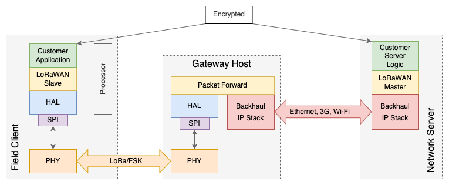

# LoRaWAN

Is a Media Access Control (MAC) layer protocol

## Spreading Factor

## Data Rate

## Further Reading

- [LoRa](LoRa.md)

!!! cite "Resources/ Bib."

    - [LoRaWAN Specification V1.1](https://lora-alliance.org/wp-content/uploads/2020/11/lorawantm_specification_-v1.1.pdf)