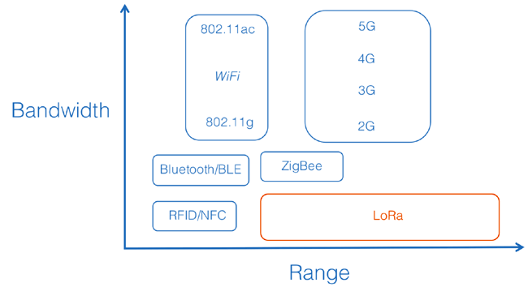

---
hide:
    - navigation

---

# LoRa (PHY)

[:octicons-arrow-left-24: Return to Networking and Communication](/Bodies-of-Knowledge/Networking-Communication/)

---

Is a spread spectrum modulation technique derived from chirp spread spectrum (CSS) technology developed by Semtech. It is a physical layer of a Low Power Wide Area Network.

## Spread Spectrum Communication
 with the trade off 

being Low Bandwidth. sensitivity and data rate, while operating in a fixed-bandwidth channel of either 125 KHz or 500 KHz (for uplink channels), and 500 KHz (for downlink c
## Modulation

### Spread Spectrum Communication

### Shannon - Hartley Theorem

@ -10,9 +16,63 @@ Is a spread spectrum modulation technique derived from chirp spread spectrum (CS

### Chirp Spread Spectrum

## Duty cycle
## Transmission

### Link budget

### Power

<!-- 154 dB                  -->

EU: 14 dBm
NZ: 0 dBW

### Frequencies

LoRa uses the Industry, Scientific and Medical (ISM) bands which don't require a licence to broadcast but do have limitations like maximum power and duty cycle. 

- AU: 915-928MHz
- EU: 868MHz
- US: 902-928MHz

## Bandwidth

fixed-bandwidth channel of either 125 KHz or 500 KHz (for uplink channels), and 500 KHz (for downlink
channels)

RX: 500 - 125kHz

### Free Space Path Loss

$$
FSPL=({{4 \pi d} \over {\lambda}})^2 = ({{4 \pi d f} \over {c}})^2
$$

$$
FSPL(dB) = 20 \log_{10} (d)+20 \log_{10}(f)-147.55
$$

## Sensitivity

Minimum detectable signal

Thermal noise

- BW: Bandwidth()
- NF: Noise Floor
- SNR: Signal-to-noise ratio

$$
Sensitivity(dBm)=-174 + 10 \log_{10} (BW) + NF + SNR
$$

## Range

## Link budget

## Fresnel zone

@ -20,8 +80,14 @@ Is a spread spectrum modulation technique derived from chirp spread spectrum (CSS

## ERP

## Further Reading

- [LoRaWAN](LoRaWAN.md)

!!! cite "Resources/ Bib."

    - [Semtech](https://www.semtech.com/lora/what-is-lora)
    - [LoRa Readthedocs](https://lora.readthedocs.io/en/latest/)
    - [Semtech LoRa](https://www.semtech.com/lora/what-is-lora)
    - [LoRa Modulation Basics](https://www.frugalprototype.com/wp-content/uploads/2016/08/an1200.22.pdf)
    - [LoRa Crash Course](https://www.youtube.com/watch?v=T3dGLqZrjIQ)
    - [Short Range Devices GURL NZ](https://www.rsm.govt.nz/licensing/frequencies-for-anyone/short-range-devices-gurl)
    - [Licence Summary RSM NZ](https://rrf.rsm.govt.nz/smart-web/smart/page/-smart/domain/licence/LicenceSummary.wdk?id=219752)