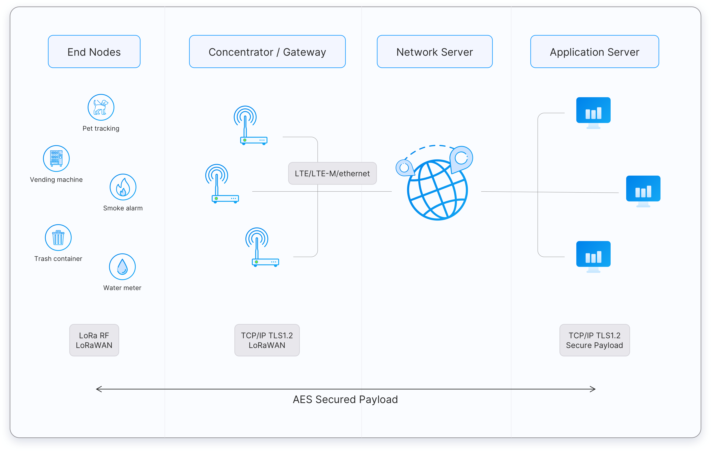

---
hide:
    - navigation

---

# LoRaWAN

LoRaWAN is a Media Access Control (MAC) layer protocol built on top of [LoRa](LoRa.md). It is a software layer which defines the use of LoRa hardware.

[:octicons-arrow-left-24: Return to Networking and Communication](/Bodies-of-Knowledge/Networking-Communication/)

---

!!! cite "Notes From"
    [LoRaWAN® | The Things Network Docs](https://www.thethingsnetwork.org/docs/lorawan/)
    Copyright The Things Network

LoRaWAN protocol is developed and maintained by the [LoRa Alliance](https://lora-alliance.org/), 
which is an open, non-profit association. They also provide certification of end devices.

LoRaWAN is an ITU standard

## LoRaWAN Architecture

LoRaWAN networks are deployed in a star-of-stars topology.

<figure markdown>

  <figcaption>LoRaWAN Architecture | The Things Network</figcaption>
</figure>

- **End Points**
    - Can be sensor (e.g. temperature, pressure, fall detection), an actuator (e.g. relay) or both. 
    - Often battery powered
    - Connected to LoRaWAN through gateways using [LoRa (PHY)](LoRa.md)
- **Gateways**
    - Registed to a network server
    - Forward messages from end devices to the network server
    - Connect to network server via a **backhaul** like Cellular, Wi-Fi, Ethernet, etc.
- **Network Server**
    - manages gateways, end-devices, applications, and users
    - Establishing secure 128-bit AES connections for the transport of messages between end-devices and the Application Server (end-to-end security).
    - Validating the authenticity of end devices and integrity of messages.
    - Deduplicating uplink messages.
    - Selecting the best gateway for routing downlink messages.
    - Sending ADR commands to optimize the data rate of devices.
    - Device address checking.
    - Providing acknowledgements of confirmed uplink data messages.
    - Forwarding uplink application payloads to the appropriate application servers
    - Routing uplink application payloads to the appropriate Application Server.
    - Forwarding Join-request and Join-accept messages between the devices and the join server
    - Responding to all MAC layer commands.
- **Application Server**
    - Processes Application specific data messages received from end-devices
    - Generates all application-layer downlink messages via the network server
    - Can have more than one
- **Join Server**
    - Assists with secure device activation, root key storage and session key generation
    - Initiated by an end device sending a join request via the network server
    - Generates session keys and transfers NwkSkey and AppSkey to Network and Application server respectively
    - Introduced v1.1

## Regional Parameters

LoRaWAN operates in unlicensed radio spectrum

In New Zealand, AU915-928 is used.

**Uplink:**

1. 916.8 - SF7BW125 to SF12BW125
2. 917.0 - SF7BW125 to SF12BW125
3. 917.2 - SF7BW125 to SF12BW125
4. 917.4 - SF7BW125 to SF12BW125
5. 917.6 - SF7BW125 to SF12BW125
6. 917.8 - SF7BW125 to SF12BW125
7. 918.0 - SF7BW125 to SF12BW125
8. 918.2 - SF7BW125 to SF12BW125
9. 917.5 - SF8BW500

**Downlink:**

1. 923.3 - SF7BW500 to SF12BW500 (RX1)
2. 923.9 - SF7BW500 to SF12BW500 (RX1)
3. 924.5 - SF7BW500 to SF12BW500 (RX1)
4. 925.1 - SF7BW500 to SF12BW500 (RX1)
5. 925.7 - SF7BW500 to SF12BW500 (RX1)
6. 926.3 - SF7BW500 to SF12BW500 (RX1)
7. 926.9 - SF7BW500 to SF12BW500 (RX1)
8. 927.5 - SF7BW500 to SF12BW500 (RX1)
9. 923.3 - SF12BW500 (RX2)

## Messages

### Uplink messages

Sent from a end device to a network server via one or many gateways.
If it belongs to an application or join server, then the network server forwards to the correct receiver.

### Downlink messages

Sent from a network server to an end device via a single gateway.
Messages may initiate from an application or join server.

### MAC messages

- **Join-request**
    - An uplink message, used by the over-the-air activation (OTAA) procedure.
    - Always initialed by an end device and sent to a network server.
    - Network server forward to join server.
    - Not encrypted.
- **Join-accept**
    - A downlink message, used by the over-the-air activation (OTAA) procedure
    - Generated by the join server
    - Passed through the network server to the end-device
    - Encrypeted with `NwkKey` if triggered by **Join-request** or `JSEncKey` if triggered by **Rejoin request type 0, 1 and 2**
- **Unconfirmed Data Up**
    - An uplink data frame, confirmation is not required
- **Unconfirmed Data Down**
    - A downlink data frame, confirmation is not required
- **Confirmed Data Up**
    - An uplink data frame, confirmation is requested
- **Confirmed Data Down**
    - A downlink data frame, confirmation is requested
- **Rejoin-request**
    - Uplink over-the-air activation (OTAA) Rejoin-request
    - Initialed by an end device and sent to network server
    - Three Types:
- **Proprietary**
    - Used to implement non-standard message formats

### Data Messages

<figure markdown>

  <figcaption>LoRaWAN Message Payload | The Things Network</figcaption>
</figure>

## Device Classes

Three classes which all support bi-directional communication. End devices must support Class A

- **Class A**
    - Communication always initiated by the end-device
- **Class B**
- **Class C**

## End Point Activation

## Spreading Factor

- SF12
- SF11
- SF10
- SF9
- SF8
- SF7

## Data Rate

## Limitations

## Further Reading

- [LoRa](LoRa.md)

## Resources/ Bib.

!!! cite ""

    - [LoRaWAN Specification V1.1](https://lora-alliance.org/wp-content/uploads/2020/11/lorawantm_specification_-v1.1.pdf)
