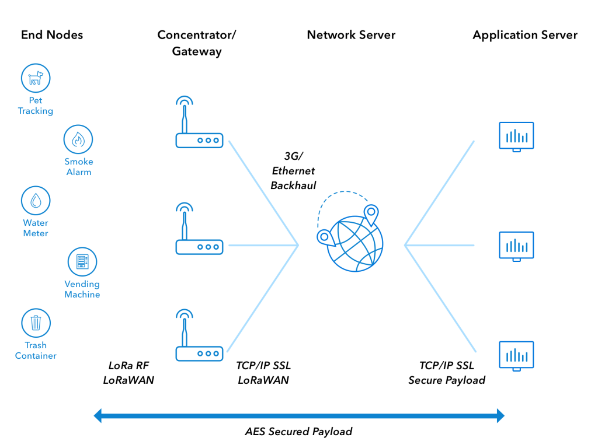

---
hide:
    - navigation

---

# LoRaWAN

[:octicons-arrow-left-24: Return to Networking and Communication](/Bodies-of-Knowledge/Networking-Communication/)

---

LoRaWAN is a Media Access Control (MAC) layer protocol

<figure markdown>
{ width="600" }
  <figcaption>LoRaWAN Topology</figcaption>
</figure>

## Spreading Factor

## Data Rate

## Further Reading

- [LoRa](LoRa.md)

## Resources/ Bib.

!!! cite ""

    - [LoRaWAN Specification V1.1](https://lora-alliance.org/wp-content/uploads/2020/11/lorawantm_specification_-v1.1.pdf)
