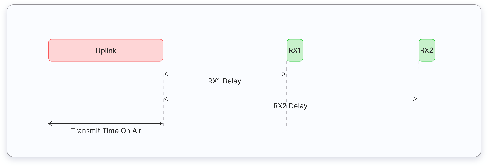
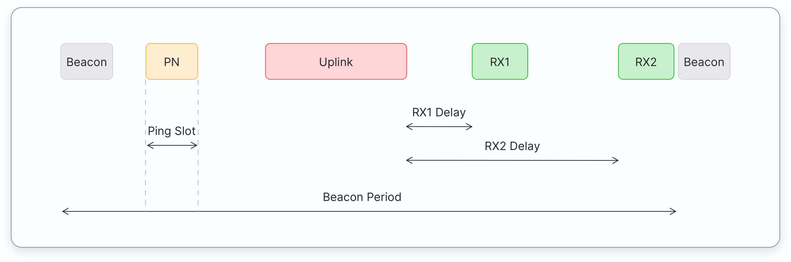
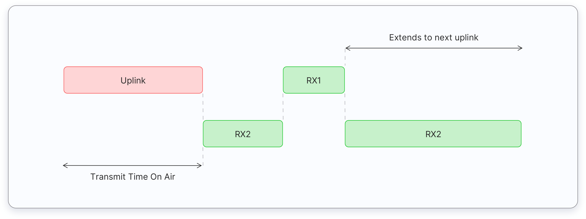

---
hide:
    - navigation

---

# LoRaWAN

LoRaWAN is a Media Access Control (MAC) layer protocol built on top of [LoRa](LoRa.md). It is a software layer which defines the use of LoRa hardware.

[:octicons-arrow-left-24: Return to Networking and Communication](/Bodies-of-Knowledge/Networking-Communication/)

---

!!! cite "Notes from"
    [LoRaWAN® | The Things Network Docs](https://www.thethingsnetwork.org/docs/lorawan/) Copyright The Things Network

LoRaWAN protocol is developed and maintained by the [LoRa Alliance](https://lora-alliance.org/), which is an open, non-profit association. They also provide certification of end devices. LoRaWAN is an ITU standard

## LoRaWAN Architecture

---

LoRaWAN networks are deployed in a star-of-stars topology.

!!! cite ""
    LoRaWAN Architecture | The Things Network

### End Points

- Can be a sensor (e.g. temperature, pressure, fall detection), an actuator (e.g. relay) or both.
- Often battery powered
- Connected to LoRaWAN through gateways using [LoRa (PHY)](LoRa.md)

### Gateways

- Registered to a network server
- Forward messages from end devices to the network server
- Connect to network server via a **backhaul** like Cellular, Wi-Fi, Ethernet, etc.

### Network Server

- manages gateways, end-devices, applications, and users
- Establishing secure 128-bit AES connections for the transport of messages between end-devices and the Application Server (end-to-end security).
- Validating the authenticity of end devices and integrity of messages.
- Duplicating uplink messages.
- Selecting the best gateway for routing downlink messages.
- Sending ADR commands to optimise the data rate of devices.
- Device address checking.
- Providing acknowledgements of confirmed uplink data messages.
- Forwarding uplink application payloads to the appropriate application servers
- Routing uplink application payloads to the appropriate Application Server.
- Forwarding Join-request and Join-accept messages between the devices and the join server
- Responding to all MAC layer commands.

### Application Server

- Processes Application specific data messages received from end-devices
- Generates all application-layer downlink messages via the network server
- Can have more than one
  
### Join Server

- Assists with secure device activation, root key storage and session key generation
- Initiated by an end device sending a join request via the network server
- Generates session keys and transfers NwkSkey and AppSkey to Network and Application server respectively
- Introduced v1.1

## Regional Parameters

---

LoRaWAN operates in unlicensed radio spectrum

In New Zealand, the 915 to 928Mhz ISM band is used. Which is licensed under a [General User Radio Licence (GURL)](https://www.rsm.govt.nz/licensing/frequencies-for-anyone/short-range-devices-gurl) for short range devices. Some specific frequencies allowed under the GURL are as follows.

| Low (Mhz) | High (Mhz) | Ref. Freq. (Mhz) | Power dBW (eirp) | Remarks |
| --- | --- | --- | --- | --- |
| 915.000000 | 928.000000 | 921.500000 | 0.0 | Special conditions 23 |
| 920.000000 | 928.000000 | 924.000000 | 6.0 | Special conditions 13 and 23 |

**Special condition 13**: Transmitters using e.i.r.p. greater than 0 dBW (1 W) must employ frequency hopping or digital modulation techniques.

**Special condition 23** Transmissions must not exceed the following unwanted emission limits: -79 dBW (-49 dBm) e.i.r.p. within 800 – 915 MHz and -63 dBW (-33 dBm) e.i.r.p. within 928 MHz – 1 GHz. The reference bandwidth for emissions is 100 kHz. Outside the band 800 MHz – 1 GHz, the limits prescribed in applicable standards prescribed in the Radio-communications (Radio Standards) Notice 2020* apply. In the absence of applicable standards, the limits prescribed in Table 2 of the notice apply.

> [Radio Spectrum Management NZ | GURL Licence Summary](https://rrf.rsm.govt.nz/smart-web/smart/page/-smart/domain/licence/LicenceSummary.wdk?id=219752)

915 to 920 should be avoided due to limitation of power required

### AS923

**Default Channels**

1. 923.2 - SF7BW125 to SF10BW125
2. 923.4 - SF7BW125 to SF10BW125

During the joining process, additional channels are set which depends on network server&#39;s implementation

### AU915

**Uplink:**

1. 916.8 - SF7BW125 to SF12BW125
2. 917.0 - SF7BW125 to SF12BW125
3. 917.2 - SF7BW125 to SF12BW125
4. 917.4 - SF7BW125 to SF12BW125
5. 917.6 - SF7BW125 to SF12BW125
6. 917.8 - SF7BW125 to SF12BW125
7. 918.0 - SF7BW125 to SF12BW125
8. 918.2 - SF7BW125 to SF12BW125
9. 917.5 - SF8BW500

**Downlink:**

1. 923.3 - SF7BW500 to SF12BW500 (RX1)
2. 923.9 - SF7BW500 to SF12BW500 (RX1)
3. 924.5 - SF7BW500 to SF12BW500 (RX1)
4. 925.1 - SF7BW500 to SF12BW500 (RX1)
5. 925.7 - SF7BW500 to SF12BW500 (RX1)
6. 926.3 - SF7BW500 to SF12BW500 (RX1)
7. 926.9 - SF7BW500 to SF12BW500 (RX1)
8. 927.5 - SF7BW500 to SF12BW500 (RX1)
9. 923.3 - SF12BW500 (RX2)

## Messages

---

### Uplink messages

Sent from a end device to a network server via one or many gateways.
If it belongs to an application or join server, then the network server forwards to the correct receiver.

### Downlink messages

Sent from a network server to an end device via a single gateway.
Messages may initiate from an application or join server.

### MAC messages

#### Join-request

  - An uplink message, used by the over-the-air activation (OTAA) procedure.
  - Always initialed by an end device and sent to a network server.
  - Network server forward to join server.
  - Not encrypted.
  
#### Join-accept

- A downlink message, used by the over-the-air activation (OTAA) procedure
- Generated by the join server
- Passed through the network server to the end-device
- Encrypted with `NwkKey` if triggered by **Join-request** or `JSEncKey` if triggered by **Rejoin request type 0, 1 and 2**
  
#### Unconfirmed Data Up

- An uplink data frame, confirmation is not required
  
#### Unconfirmed Data Down

- A downlink data frame, confirmation is not required

#### Confirmed Data Up

- An uplink data frame, confirmation is requested

#### Confirmed Data Down

- A downlink data frame, confirmation is requested

#### Rejoin-request

  - Uplink over-the-air activation (OTAA) Rejoin-request
  - Initialed by an end device and sent to network server
  - Three Types:

#### Proprietary

- Used to implement non-standard message formats

### Data Messages

  LoRaWAN Message Payload | The Things Network

## Device Classes

---

Three classes which all support bi-directional communication. End devices must support Class A

### Class A

- Communication always initiated by the end-device, at any time
- After uplink finished, two short receive (downlink) windows are opened (RX1 and RX2)
- If server failed to respond to the windows the next downlink will be after the next uplink
- Server can respond to ether the first or second window
- Delay between the end of uplink and RX1, and RX2

!!! cite ""
    LoRaWAN Device Class A | The Things Network

### Class B

- In addition to Class A, B opens scheduled receive windows
- Gateways transmits time-synchronised beacons
- End-device opens downlink ‘ping slots’ at scheduled times
- Time between two beacons is known as the beacon period.
- Reachable at preconfigured times
- Don&#39;t need to send an uplink to receive downlink messages

!!! cite ""
    LoRaWAN Device Class B | The Things Network

### Class C

- Extends Class A
- Keep receive windows open unless transmitting
- Low-latency communication
- High energy consumption (often mains powered)

!!! cite ""
    LoRaWAN Device Class C | The Things Network

## End Point Activation

---

Every end device must be registered with a network before sending and receiving messages.

### Over-The-Air-Activation (OTAA)

- Recommended way
- Devices perform a join procedure
- Dynamic device address is assigned

### Activation By Personalisation (ABP)

## Spreading Factor

---

LoRa, being based off Chirp Spread Spectrum (CSS) technology, chirps (also known as symbols) are the carrier of data.

The spreading factor controls the chirp rate, and thus the data rate.

Each increase of spreading factor, halves the chirp sweep rate

### Data Rate

In comparison with a higher spreading factor (SF), a lower SF provides a higher bit rate with a given bandwidth and coding rate

### Distance

### Time-on-Air

- SF12
- SF11
- SF10
- SF9
- SF8
- SF7

## Adaptive Data Rate

---

## Limitations

---

## Packets

---

## Further Reading

---

- [LoRa](LoRa.md)

## Resources/ Bib.

!!! cite ""

    - [LoRaWAN Specification V1.1](https://lora-alliance.org/wp-content/uploads/2020/11/lorawantm_specification_-v1.1.pdf)
    - [LoRaWAN Regional Parameters](https://lora-alliance.org/wp-content/uploads/2021/05/RP002-1.0.3-FINAL-1.pdf)
    - [What is LoRaWAN® Specification](https://lora-alliance.org/about-lorawan/)