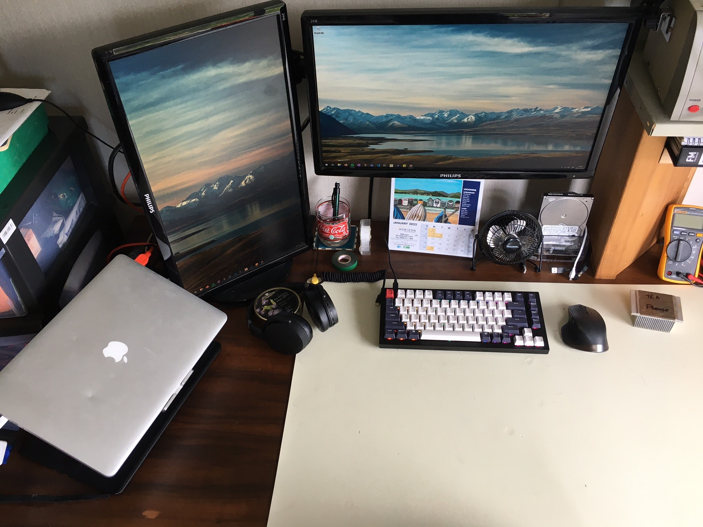
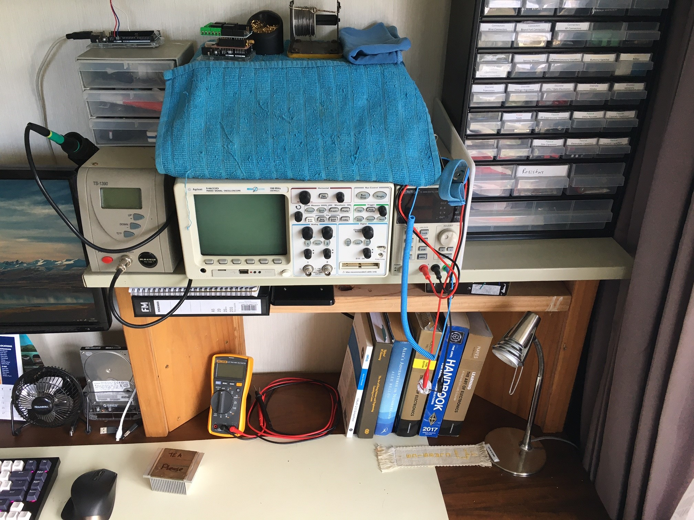
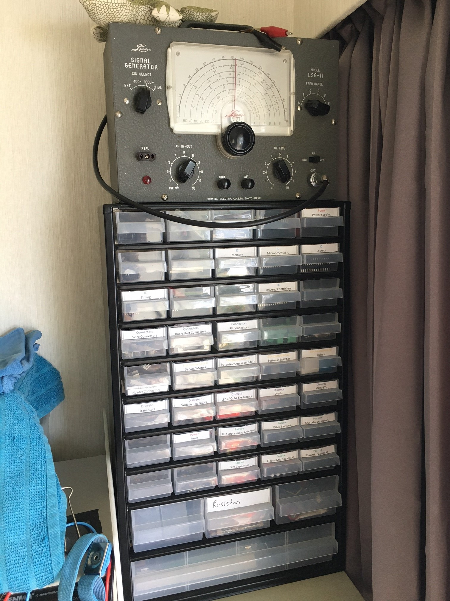
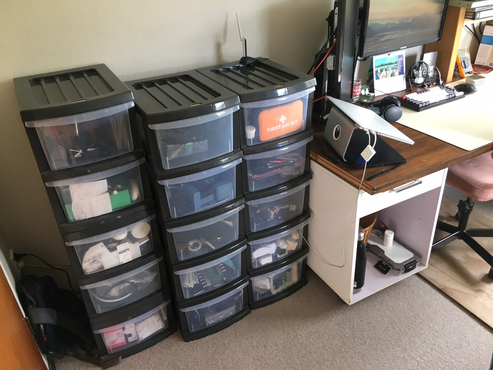

# 2022 Journal

---

## New Knowledge Section, Feb 2022

I recently discovered [ACM Computer Science and Engineering Curricula](https://www.acm.org/education/curricula-recommendations) while looking for an outline of computer science. It provides a great wide ranging and detailed base which I will use as a launchpad to record my  learnings from university and new work and independent learnings.

Since high school I have seen the need for new knowledge to build upon pervious. This became more apparent during university where each paper build on previous more heavy. Recording of knowledge to quickly remember the what (as in a glossary), the who, when, where and why(wiki) and the how (tutorial) of subjects. During research, I found the Zettelkasten method. This would be useful as recording new thoughts on a (multiple) topics could be combined to speed up reports.Articles are both the teacher and student. Articles could use the Feynman Technique, where you learn by teaching.

1. Choose a Topic and conduct research on a it
2. Explain the topic as if your teaching someone else
3. Review/ Revise unknown or poorly known areas
4. Review/ Revise overly technical explanations

!!! cite
    [https://collegeinfogeek.com/feynman-technique/](https://collegeinfogeek.com/feynman-technique/)

Aims of recording are to assist in my desire to learn, remember and track progress. 

*Check it out...*    [Bodies of Knowledge](/Bodies-of-Knowledge/){ .md-button .md-button--primary }

---

## Home Work Space for 2022, 22nd Jan.

Have Mac and Windows computers with the recent arrival of a Keychron Q1 to partner an MX Master.

Agilent 54622D Oscilloscope, Soldering Iron, Fluke 117, Bench Power Supply, IC Programmers, Textbooks

A myriad of Passive, Discrete, Electromechanical components along side ICs, Dev Boards, Arduino Shields and Proto Equipment

Storage of all sorts of bits and bobs.
