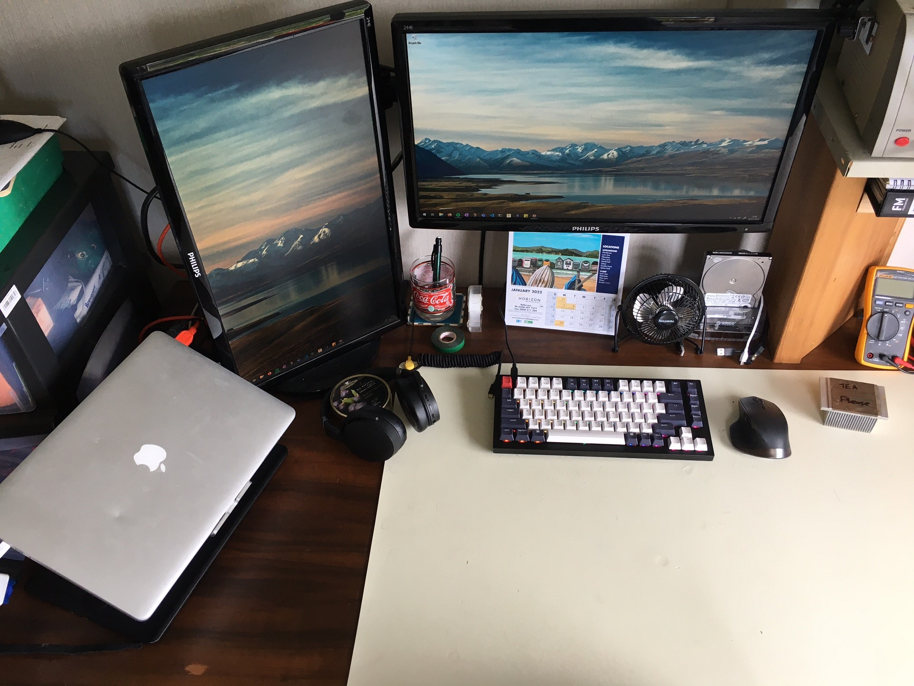
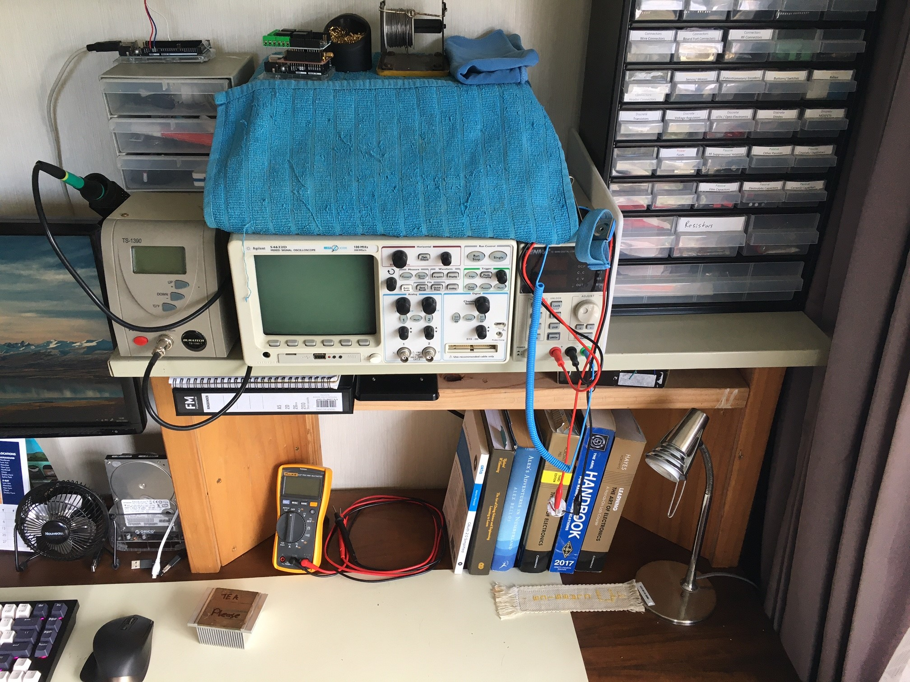
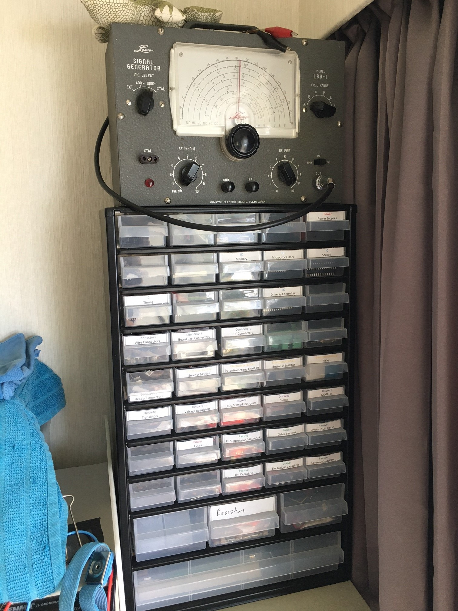
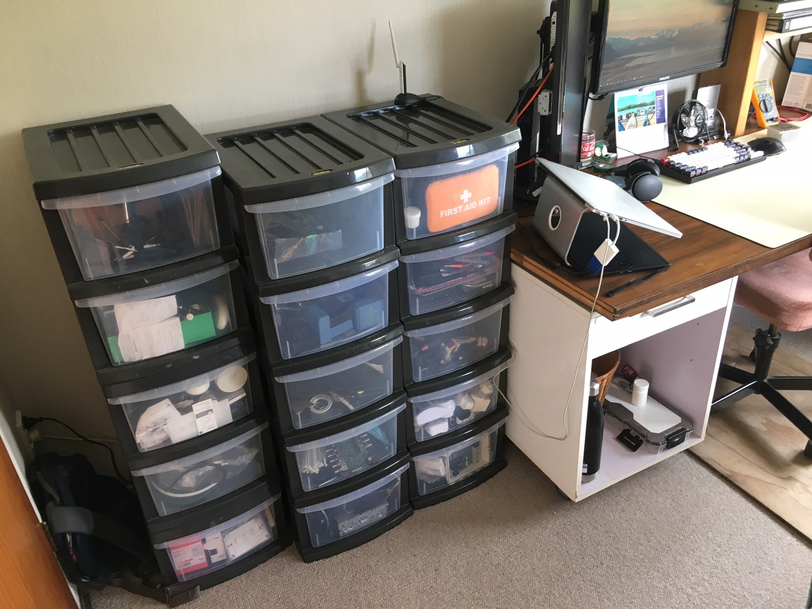

# January 2022 Journal

## Home Work Space for 2022, 22nd

---

Have Mac and Windows computers with the recent arrival of a Keychron Q1 to partner an MX Master.

Agilent 54622D Oscilloscope, Soldering Iron, Fluke 117, Bench Power Supply, IC Programmers, Textbooks

A myriad of Passive, Discrete, Electromechanical components along side ICs, Dev Boards, Arduino Shields and Proto Equipment

Storage of all sorts of bits and bobs.
