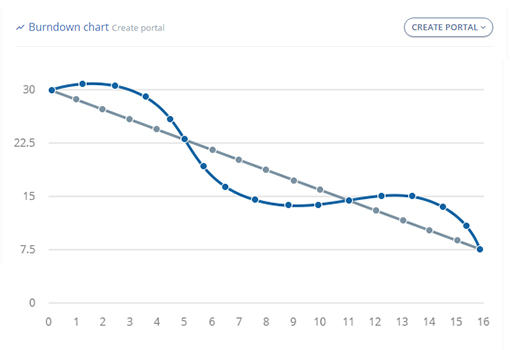

---
hide:
    - navigation

---

# Scrum

[:octicons-arrow-left-24: Return to Software Engineering](/Knowledge-Notebook/Software-Engineering/)

---

Scrum is a framework used by teams to help collaboration by implementing the principles of [Agile](../01_Software-Processes#agile) in a concrete set of roles, activities and practices.

<figure markdown>
  
  <figcaption>Scrum lifecycle, Microsoft</figcaption>
</figure>

## Roles

### Product Owner

- Maintains the direction and vision of the software product and why it is important to the customers and/or client
- Maximise the value of the product by being the **single authority** responsible for deciding which **features** and **functionality** to build and there order.
- They are the central leadership and bridge between stakeholders and the Development Team
- The whole team advises the Product Owner
- Responsible for the success or failure of the product
- Product Owner is NOT a "Project Manager"

### Scrum Master

- Helps all members understand and embrace the Scrum values, principles and practices
- Servant-leader coaching the Dev. Team and Product Owner
- Help an organisation implement their own specific scrum approach
- Scrum Master is NOT an "IT Manager"

### Developers (Development Team)

- Organise themselves to find the best way to achieve the project goals
- Typically five to nine members
- **Collectively** have all skills needed to deliver the product
- Design, Develop, Test and Document the product
- Communicate with the product owner to gain insight and feedback
- Work with the scrum master to remove blockages
- Use the scrum activities and create artifacts

## Activities

### Sprint Planning

#### Definition of Done (DoD)

Is decided upon before a sprint, ether shared across many stories or specificallshould mean that the feature is shippable to the customer and meets all required tests (acceptance, unit, system, etc.). The Product Owner officially *"Accepts"* Done features from the team during the Sprint Review.

### Sprint

A sprint is a fixed length of around 2-4 weeks where a team works to complete a set number of work.

### Sprint Execution

Scrum does not specify how the team should execute work. However normally designated developers of a user story take one at a time from the **'Sprint Backlog'** into an **'In Progress'** column. Here they perform low level design, coding and initial testing to meet the DoD. When the develop believes the DoD has been meet, they move the story into the **'In Testing'** column. The designated tester of a user story then either uses existing tests and/ or new tests with a variation of methods to discern whether it meets the DoD, if so, it will then be moved into the **'Done'** column.

#### Daily Scrum Meeting (Standup)

This is a daily meeting limited to fifteen minutes. Team members usually stand to keep it short. They talk about progress since the previous meeting, there plans for today and anything impeding there progress.

### Sprint Review

The team demonstrates what they've accomplished to stakeholders. They demo the software and show its value.

### Sprint Retrospective

The team takes time to reflect on what went well and which areas need improvement. The outcome of the retrospective are actions for next sprint. E.g. (3)

- Liked
- Lacked
- Learnt
- Longed for

### Product Backlog Refinement

## Artifacts

### User Stories

#### MoSCoW

- Must have
- Should have
- Could have
- Would have

#### Story Points

Fibonacci Number Sequence - 1, 2, 3, 5, 

#### INVEST Analysis

- Independent
- Negotiable
- Value
- Estimable
- Small
- Testable

### Product Backlog

The *product backlog* is a prioritised list of value the team can deliver. The product owner is responsible for the backlog and adds, changes, and reprioritises as needed. The items at the top of the backlog should always be ready for the team to execute on. (4)

### Sprint Backlog

The *sprint backlog* is the list of items the team plans to deliver in the sprint. Often, each item on the sprint backlog is broken down into tasks. Once all members agree the sprint backlog is achievable, the sprint starts. (4)

### Sprint Burndown

Is a graph containing user story points on the y axis and days on the x axis. It maps the total remaining user story points per day with an 'ideal burndown' which is a linear reduction in remaining user story points to zero. The aim is to keep 'actual burndown' as close to or below the ideal burndown and serves as a visual tool for the team to track progress.

<figure markdown>
  
  <figcaption>Example Burndown Graph</figcaption>
</figure>

### Velocity

### Potentially Shippable Product/ Increment

A sprint's output should be of shippable quality, even if it's part of something bigger and can't ship by itself. It should meet all the quality criteria set by the team and product owner.

---

There still needs to be internal accountably.

## Resources/ Bib

!!! cite ""
    1. [Scrum.org](https://www.scrum.org/)
    2. [ScrumAlliance.org](https://www.scrumalliance.org/)
    3. [Atlassian Agile Coach, Scrum](https://www.atlassian.com/agile/scrum)
    4. [Microsoft](https://docs.microsoft.com/en-us/devops/plan/what-is-scrum)
