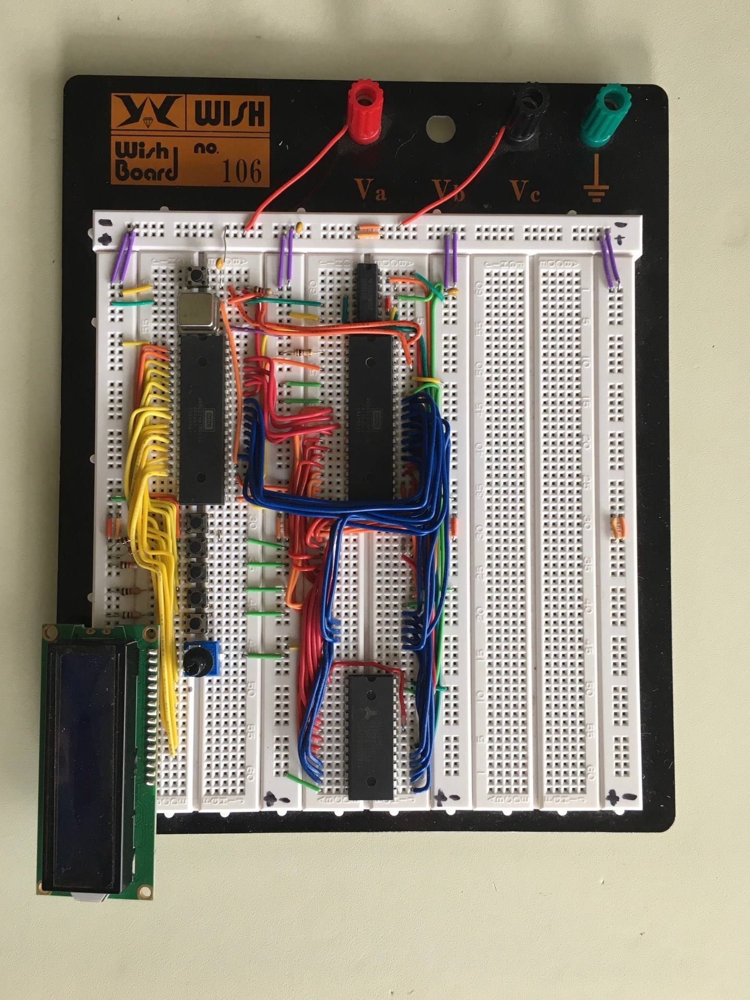

# 6502 Computer

---

Initiated from Ben Eater's Design

## Bill of Materials

| Item                    | Qty |
| ----------------------- | --- |
| 6502                    | 1   |
| Parallel ROM            | 1   |
| Parallel RAM            | 1   |
| 6522                    | 1   |
| 6521                    | 1   |
| 16x02 LCD               | 1   |
| NAND GATE               | 1   |
| 1MHz Clock              | 1   |
| Push buttons            | 5   |
| 1K ohm resistor         | 2   |
| 10 uF ceramic Capacitor | 4   |

## BreadBoard

6502 Computer without EEPROM

## EEPROM Programmer

Ben Eater used an Uno with 2 74' Shift registers. I didn't have any on hand, but the reason for the shift registers was due to the lack of digital outputs on the Uno. I did have a Mega on hand which has many more outputs. 

Found this code: [GitHub - crmaykish/AT28C-EEPROM-Programmer-Arduino: Programming the AT28C64B or AT28C256 EEPROM chip with an Arduino Mega](https://github.com/crmaykish/AT28C-EEPROM-Programmer-Arduino)

Which uses a Arduino Mega but found connecting all leads to be a waste of time. 