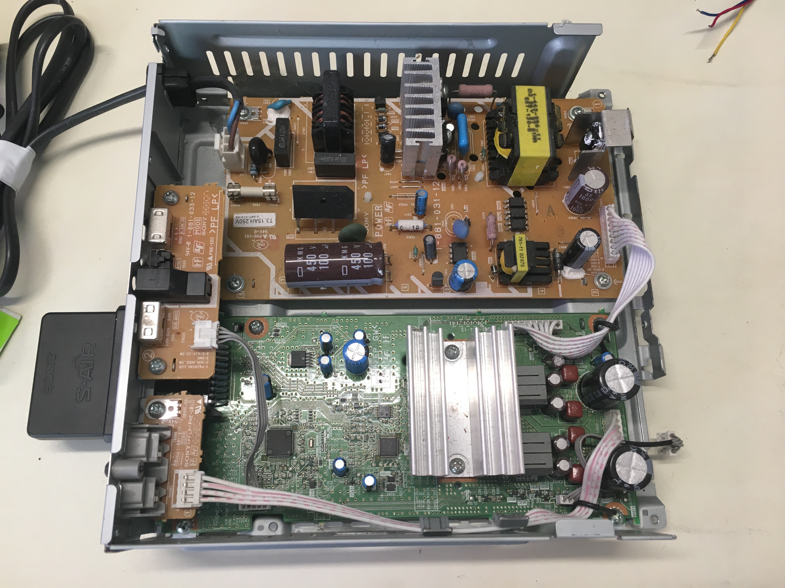

# Sony S-AIR Wireless Amplifier

I came across this Sony S-AIR Amplifier while at the local waste recycling shop and thought it may be of interest. I had never heard of "S-AIR" before so was intrigued. 

## External

Taking a look at the device it is 205mm wide by 210mm deep and 55mm tall. It has a single tactic power button on the front with what is labeled as "S-AIR/STANDBY" LED indicator. On the rear, it is labeled as Model No. TA-SA200WR, Surround Amplifier. It has two labeled section, the first being "S-AIR ID" which has a three way slide switch with A, B and C positions. It also has a PAIRING button with associated LED. The second section has a "speakers" label which has Left and Right two pin connectors which can support 3-16 ohm impedance speakers.  There is also a two way slide switch which controls the surround position (surround or rear).  

## Tear Down

## Internals

<!--  -->

On the Main PCB, near the Card Edge Connector. There is a silkscreen label with the following:

1. GND
2. VCC 3.3V
3. GND (for DET)
4. MCLK
5. A0
6. A1
7. INT
8. DEBUG_TXD
9. CONNECT
10. Link_IND
11. I2C_SCL
12. RESET
13. SDIN_B(Surr)
14. I2C_SDA
15. LRCK
16. SDIN_D