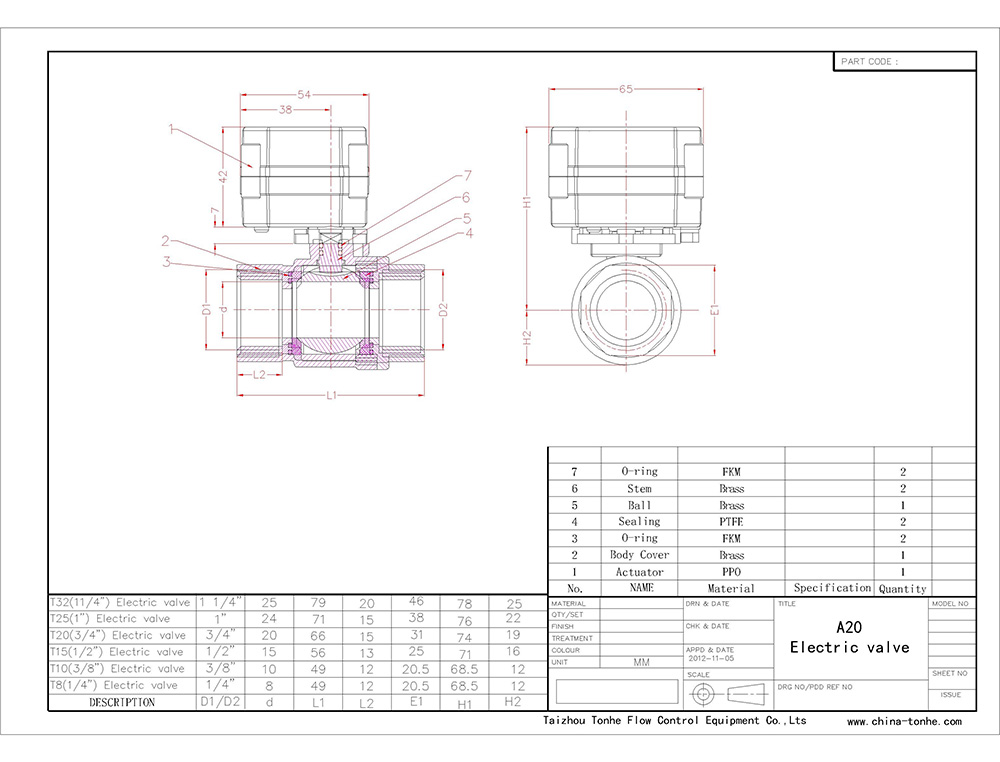

# Motorised Valve OEM Teardown

Teardown of U.S. Solid USS-MSV00020 (1-inch, 25 mm NPT) purchased from Amazon. Unboxing it from a small white box which contains the valve(obviously) and an installation and wiring diagrams information sheet. 

**Who/ what is US Solid:** “Founded in 2011 U.S. Solid is new generation manufacturer of precision laboratory cuvettes, laboratory material and equipment. U.S. Solid is founded by four PhD. students with extensive experience in spectroscopy techniques but also mechanical and chemical engineering. We came to a conclusion that the today’s market is saturated with questionable quality, high cost and above all expensive laboratory equipment.”[^1] 

If you navigate amazon for motorised valves there appears to be multiple companies producing the same valve. When searching the model number given by multiple companies, it leads to Tonheflow (www.motorized-valve.com) as the original manufactures of the valves, which US Solid also sell. On inspection of the top plastic cover, it has a deeper blue colour which may indicate that it has been replaced with a US Solid branded cover. 

!!! warning ""
    I am not claiming US Solid do resell Tonheflow. Just the possibly

**Claimed Stats:**

- 9-24V AC/DC
- <2Nm
- IP65
- 2W max power
- 1” brass
- <40˚C ambient temperature
- <100˚C medium temperature
-  5 second open/close time
- <1MPa medium pressure
 

## Physical Design

{ align=right }

The valve is made from brass which can tarnish easily with high levels of bare skin handling. The valve mounding has DN25 which indicates it was made in a country which uses metric measurements. It uses a 1” female NP Thread 

## Electrical Design

There are three variants, that being; two, three and five wire versions. The following is of the three-wire version. Once the top cover is removed, a single PCB with a variety of through-hole and SMD component can be observed. The input wires are soldered onto the PCB with six other wires being (left to right) Switch close out/in, Switch open in/out, Close, Ground, Open, Motor -/+. The PCB can be broken into three sections, a step-down converter, H-bridge and switch logic. 

{ align=right }

Power is supplied to the buck converter by external switching of a power source through ether Open/Ground or Close/Ground. Once a voltage is applied to the circuit, power is diverted off the open or close lines through a diode to a junction (6D Figure 3). This then passes through a 0.5A[^2] resettable fuse and across the top of a diode, varistor and polarised capacitor then into Vcc of the MC3463A IC. 

<figure markdown>
  
  <figcaption>Figure 3</figcaption>
</figure>

[^1]: US Solid. (2019). About us. Retrieved from US Solid: [https://ussolid.com/about-us/](https://ussolid.com/about-us/)
[^2]: Unsure on value
