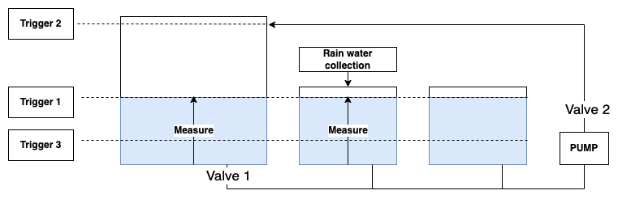
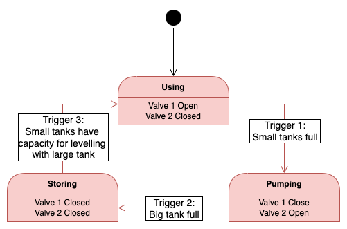
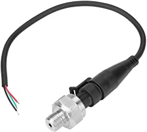
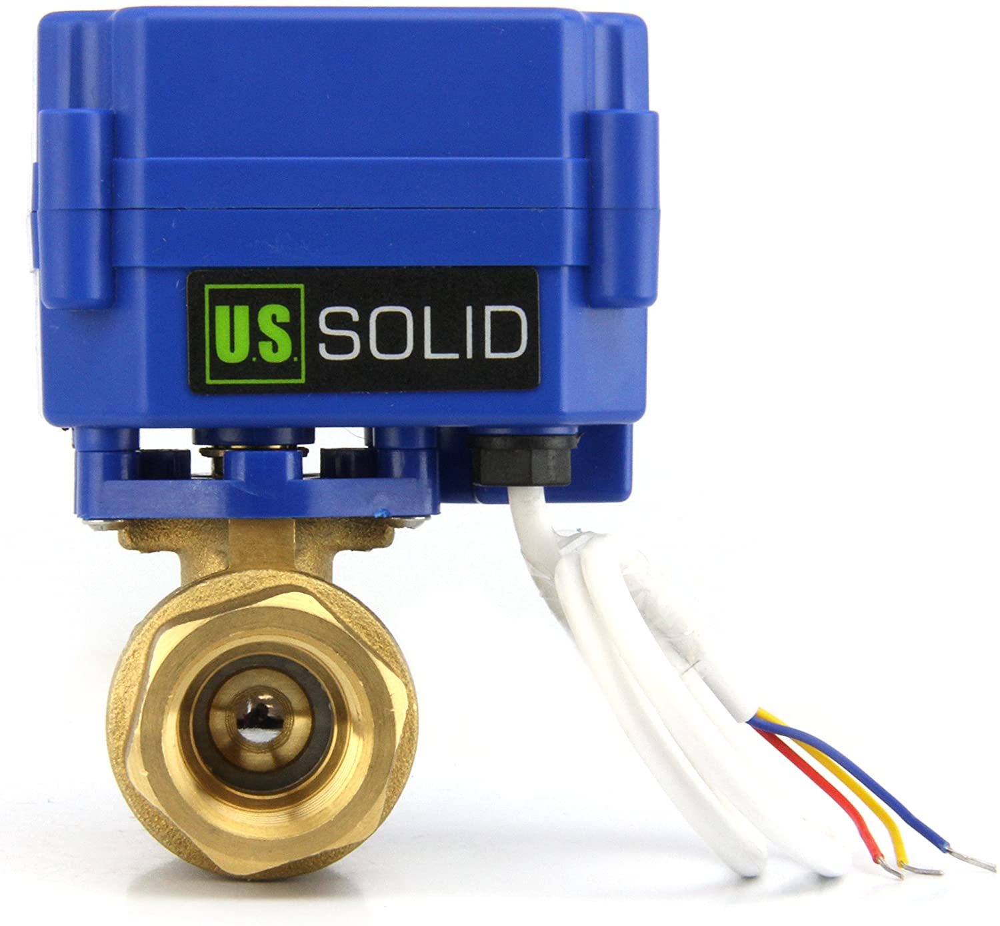
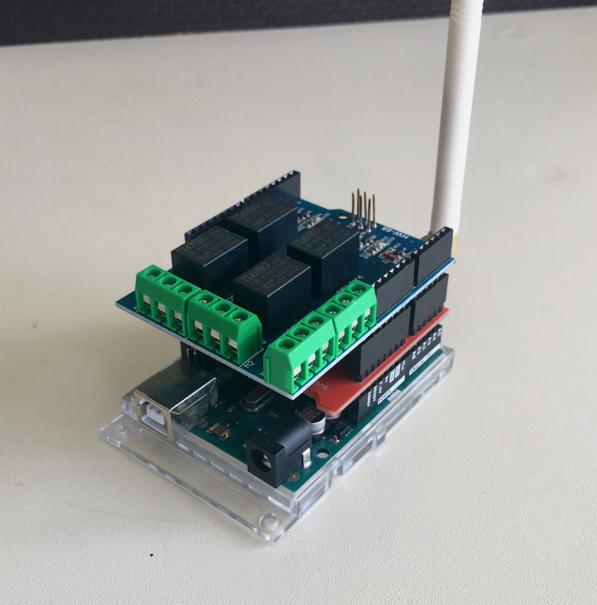
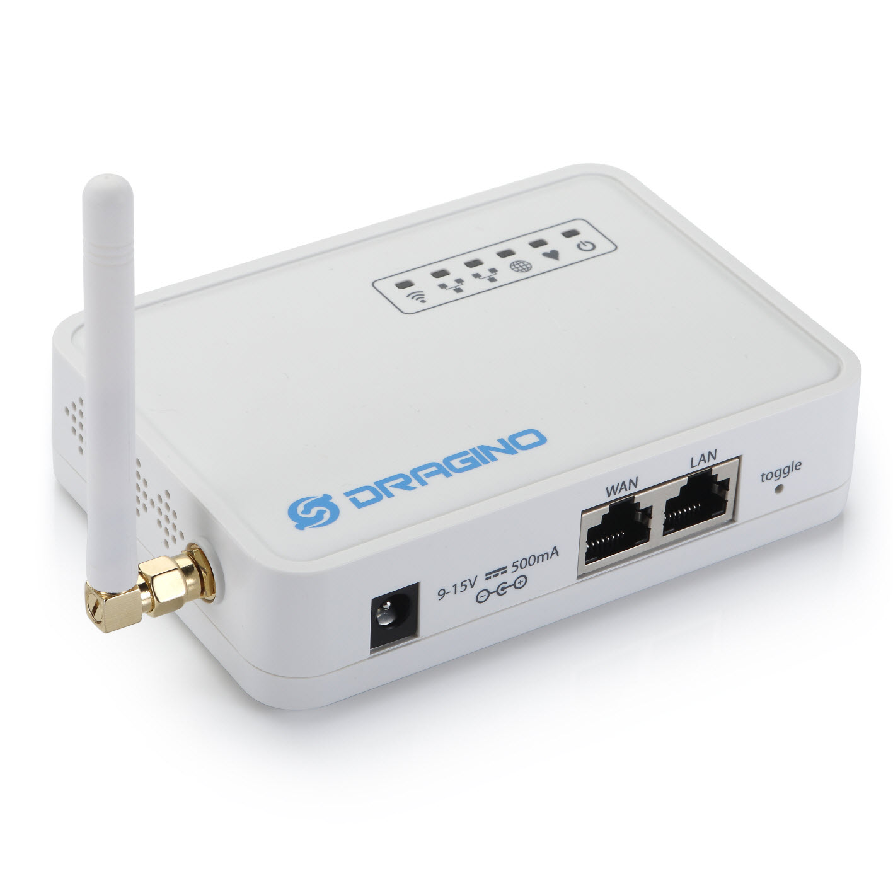
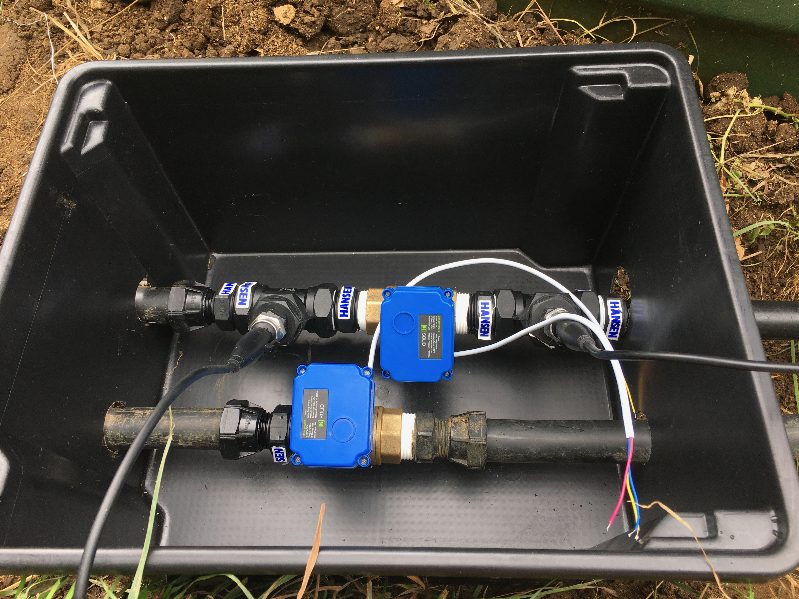

---

hide:
    - navigation
---
# Water Tank Monitor & Control

[:octicons-arrow-left-24: Return to Projects](/Projects/)

---

## Problem

After a failed attempt to install a larger capacity water tank (taller) at the same level of some existing tanks, it was installed so that it had to be isolated before its full capacity could be achieved.

This lead to manually having to shut an output ball valve before opening an input ball valve. However, this procedure more often than not had to be preformed when it was raining (meaning someone had to get wet).

## Aims

1. Develop a system which to report the water level in multiple tanks.
2. Develop a system which to automatically trigger a procedure at  set  to control multiple valves.

## Idea

<figure markdown>

  <figcaption></figcaption>
</figure>

Monitor the hight of water in one of the small tank (linked), when they are full, shut off the larger tank and start pumping water into it. When the large tank

There is a chance of a forever loop where water pumped from the smaller tanks triggers a "low water" setting. Water is then let back into the smaller tanks, triggering "high water" setting and pumping repeats... To stop this, an allowance of water should be added onto calculations of available free capacity to gain a leeway with the "high water" trigger point.

### Trigger points

#### Trigger 1

Small tanks have a diameter of 1700mm and hight of 1550mm, giving a volume of 3,518 litres. Volume of both small tanks is 7,036 litres.

**Trigger point 1 when small tanks water hight >= 1550mm**

#### Trigger 2

Large tank has a diameter of 2940mm and hight of 2200mm, giving a volume of 15,000 litres.

**Trigger point 2 when large tank water hight >= 2200mm**

#### Trigger 3

Volume of large tank at 1.55m hight is 10,183 litres.
Total volume of all tanks at 1.55m hight is 17,219 litres.

Extra capacity gained by filling the large tank: 15,000 - 10,183 = 4,817 litres. So, 4,817 litres of free capacity (plus allowance) is needed in the smaller tanks for water not to overflow (or trigger a forever loop).

7,036 - 4,817 = 2,219 litres of water in small tanks. Divided by 2 tanks gives 1109.5 litres each which is at 0.48m hight. The small tanks won't be pumped dry before trigger 2. However, trigger 3 should be lower than the remaining water level after trigger 2, or else, water will be let right back in. Setting the allowance of 109.5 litres would mean 1000 litres (per small tank) or 440mm hight.

**Trigger point 3 when small tanks water hight <= 440mm**

### State Diagram

<figure markdown>

  <figcaption></figcaption>
</figure>

## Field Unit

### Water Level Monitoring

| Sensor | Mounting | Range | Accuracy |
| --- | --- | --- | --- |
| Ultrasonic | Top downwards facing | | |
| Infrared Proximity | Top downwards facing | | |
| Float actuator | Side of tank | Only one physical level monitored | |
| Pressure (thread) | | | |
| Pressure (submerged) | | | |

I decided to go with the pressure transducer as I wanted a continuos readout of current water level and mounting issue regarding the top of tanks.

<figure markdown>

  <figcaption>G1/4" Pressure Transducer with metal housing</figcaption>
</figure>

The pressure transducer outputs a linear voltage between 0.5-4.5V in portion to it's pressure rating. The pressure a head of water applies at a given depth doesn't change with volume, but with high of water($h$) above and can change with density as seen in the equation. 
$$
P=\rho gh
$$
Where density($\rho$) for freshwater is $997.0474 kg/m^3$, gravity($g$) is $9.80665m/s^2$ and pressure is in kPa.

[Here is a nice pressure/ depth calculator](https://bluerobotics.com/learn/pressure-depth-calculator/)

We can rearrange the equation so that given a pressure we can calculate the hight of water in a tank.
$$
{P \over \rho g} = h
$$

My tanks are between 1.8 to 3 metres high, therefore the maximum pressure expected would be,
$$
997.0474 \cdot 9.80665 \cdot 3 = 29.33kPa
$$

we therefore want a pressure transducer to have as close to 4.25psi to get the highest resolution (pressure per meter). The closest value I could find was 10psi. This would result in a resolution of 1psi/metre and as the tank is 3 metres we only get a usable pressure range from 0 to 3psi.

$$
P = {{v \pm b} \over c}
$$

Where b is an offset and c is a change in slope* (not sure).
$$
P = {{v - 0.5} \over 0.4}
$$
Which outputs psi, however we need kPa. To convert psi to kPa, 1psi = 6.8947572932 kPa
$$
P \times 6.8947572932
$$
We can then substitute the above into 

$$
{{({{v - 0.5} \over 0.4} \times 6.8947572932)} \over (997.0474 \times 9.80665)} = h
$$

Now we can calculate the volume of water in a tank assuming that it is a cylinder.
$$
V = \pi r^2 h
$$

Thus, to know the volume(litres) of water present, only the voltage(0-5v) from the transducer and radius(mm) of the tank is needed. If percentage of capacity is wanted, then the hight(mm) of the tank would also have to be known. Also of note, the transducer has to be at the same level as the bottom of the tank.

## Water Control

The secondary aim of the project was to remotely control the water level in multiple tanks. This meant controlling valves and pumps to move water around the network. With the current water system, the pump has kick-in/ cutoff pressure points. This means that simply controlling valves would be enough for the pump to turn on and off by itself (if however pump control is needed, a high power (250VAC 15A) relay could be used, preferable with a Photo-TRIAC Optocoupler to trigger the coil). Found two valve options:

1. Solenoid Valve

2. Motorised Ball Valve

I decided to go with the Motorised Ball Valve as it doesn't require continuos power to keep open and can handle higher pressures with less intrusion.

<figure markdown>
{ width="400" }
  <figcaption>1" Motorised Valve with brass housing</figcaption>
</figure>

!!! note ""

    See my teardown of it [here](/Journal/entries/motorised-ball-valve)

As the Motorised Ball Valve is of a three wire type, it's controlled with "Open", "Close" and "Ground" wires. A SPDT switch is needed to throw between the open and closed states. I chose a relay which could cope with the valve's stated power of 2W at 9-12VDC.

### Field Controller

I decided to use a Arduino due to easy prototyping with its hardware abstraction layer and compatibility with a range of "shields".

<figure markdown>
{ width="500" }
  <figcaption>Arduino Uno with a Dragino 915MHz LoRa shield (RFH95) and Relay shield.</figcaption>
</figure>

!!! warning ""
    As stated in the [Aims](#aims), I would like the system to automatically trigger a control procedure. That procedure being to fill the larger tank when the smaller tanks react capacity. This system is not safely critical, but it would be annoying if the system stopped working each time it lost connection with an external server. So some local control program would be needed.
    

    **Problem:** How to program the control system new and in the future?

#### Pinout

| Pin | Function   |
| --- | ---------- |
| D1  | Relay 1    |
| D2  | Relay 2    |
| A1  | Pressure 1 |
| A2  | Pressure 2 |

#### Analog to Digital

#### Local Control System

### Power

## Network

As you will soon find out is I bought a LoRa gateway which doesn't support public LoRaWAN. Therefore I had to have a private LoRa network.

## LoRa Communication

### Gateway

<figure markdown>
{ width="400" }
  <figcaption>Dragino LG01-N Single Channel LoRa IoT Gateway</figcaption>
</figure>

## Application Server

### MQTT Broker

### Application API

|
| - Locations 

### Database

## User Client

## Installation

