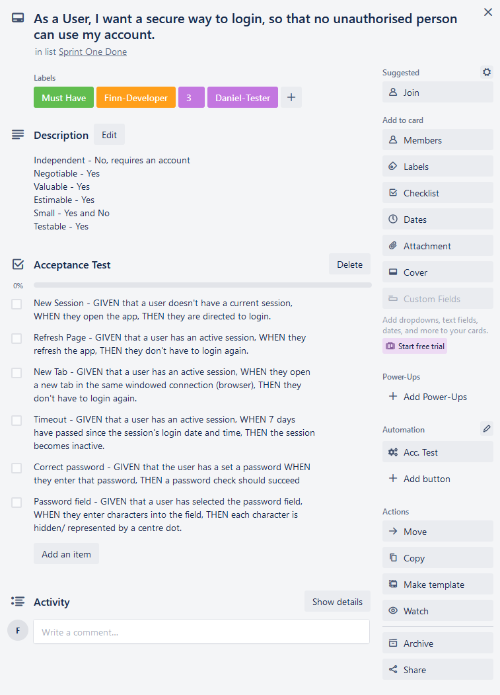

# Flinder (Flatmate Finder React App)

Flinder is a social media app that helps you find your ideal flatmate based on their personality and living preferences. Either you can be a Flatee (a person who looks for a flat to stay in), or a Flat (a person looking for a flatmate to fill in the spot).

This was a university project from Software Development Practice paper of which I gained an A- grade.

## Features

---

- Authentication service with Json Web Tokens
- Multiple access and view Roles (Admin, Flat, Flatee)

## Tech Stack

---

Based off a MERN Stack.

### Front-end

Decided upon developing a webapp over native mobile due to team members hardware constraints and a limited time frame. Decided upon using Node.js. Looked into React Native but decided to start off with React and look into migrating too it later.

#### Styling

Used MUI

#### Testing

Created End-to-End tests with Cypress

---

### Back-end

Decided to use a RESTful API with the possibility of changing front-end client.

Express.js

#### Routes/ Endpoints

#### Testing

Used [TDD](../../Second-Brain/Computer-Science/Software-Development/Methods/TDD.md) by developing a HTTP assertion test with [Supertest](https://www.npmjs.com/package/supertest). Then developed the Express.js code to make the test succeed. Repeated with more assertion tests for new a existing routes.

---

### Database

Setup a document database with MongoDB's Atlas service.

Then created models

Mongoose

---

### Integration and Delivery

TravisCI

Heroku

## Scrum

---

### Project Proposal

### Sprint 0 (Up-skilling)

Setup a Scrum Board with the following columns

- Product Backlog
- Sprint One Backlog
- Sprint One Development
- Sprint One Testing
- Sprint One Done
- Sprint Two ...

Developed User Stories using the "As a X, I want to ..., so that ..." format placing them under the product backlog. Then completed INVEST analysis on each user story to judge the quality of each story. Created multiple acceptance tests with a title, then using the "GIVEN that ..., WHEN ..., THEN ..." format.

<figure markdown>
  
  <figcaption>Example User Story (with dev and tester from sprint planning)</figcaption>
</figure>

### Sprint 1

#### Planning

Developed a Sprint Goal to develop an app which lets users list/ find a flat/ flatmate. Then when through the product backlog selecting all user stories needed to complete the sprint goal.

#### Execution

Completed multiple daily standup meetings with the "Yesterday I ..., Today I will ..., What's blocking me is ...".

#### Review

#### Retrospective

### Sprint 2

### Reflection
