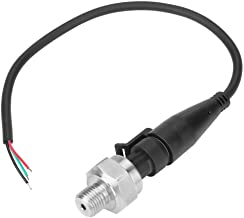

# Water Tank Monitor & Control

## Problem

After a failed attempt to install a larger capacity water tank (taller) at the same level of some existing tanks, it was installed so that it had to be isolated before its full capacity could be achieved.

This lead to manually having to shut an output ball valve before opening an input ball valve. However, this procedure more often than not had to be preformed when it was raining (meaning someone had to get wet).

## Aims 

1. Develop a system which can monitor the water level in multiple tanks.
2. Develop a system which can be automatically trigger a procedure to control multiple valves.
   
## Monitoring

The main aim of the project was to remotely monitor the water level in multiple tanks. I proceeded to conduct research on possible input methods:

### Input 

1. Ultrasonic (inside, top of tank)
    - Pro:
    - Con:
2. Float actuator
    - Pro: 
    - Con: Only one physical level monitored, no"soft" adjustment.
3. Infrared Proximity Sensor
    - Pro:
    - Con:
4. Pressure Transducer
    - Pro:
    - Con:

I decided to go with the pressure transducer as I wanted a continuos readout of current water level and mounting issue regarding the top of tanks. 
<figure markdown>

  <figcaption>G1/4" Pressure Transducer with metal housing</figcaption>
</figure>

The pressure transducer outputs a linear voltage between 0.5-4.5V in portion to it's pressure rating. The pressure a head of water applies at a given depth doesn't change with volume, but with high of water($h$) above and can change with density as seen in the equation. 
$$
P=\rho gh
$$
Where density($\rho$) for freshwater is $997.0474 kg/m^3$, gravity($g$) is $9.80665m/s^2$ and pressure is in kPa.

[Here is a nice pressure/ depth calculator](https://bluerobotics.com/learn/pressure-depth-calculator/)

We can rearrange the equation so that given a pressure we can calculate the hight of water in a tank.
$$
{P \over \rho g} = h
$$

Now we can calculate the volume of water in a tank assuming that it is a cylinder.
$$
V = \pi r^2 h
$$

My tanks are between 1.8 to 3 metres high, therefore the maximum pressure expected would be, 
$$
997.0474 \cdot 9.80665 \cdot 3 = 29.33kPa \text{ or } 4.25psi
$$
we therefore want a pressure transducer to have as close to 4.25psi to get the highest resolution (pressure per meter). The closest value I could find was 10psi. This would result in a resolution of 1psi/metre and as the tank is 3 metres we only get a usable pressure range from 0 to 3psi.

$$
P = {{V \pm b} \over c}
$$

where b is an offset and c is a change in slope^* (not sure).

the transducer outputs volts per psi, however we need kPa. 1psi = 6.8947572932 kPa

$$
P = {{V - 0.5} \over 0.4}
$$

we can then substitute the above into 

$$
{{{V - 0.5} \over 0.4} \over \rho g} = h
$$

### Field Client

Is an **Arduino Uno** with a Dragino 915MHz LoRa shield (RFH95). 

### Gateway/ Broker

### API

### User Client

Given that 

## Control

The secondary aim of the project was to remotely control the water level in multiple tanks. This meant controlling valves and pumps to move water around the network. With the current water system, the pump has kick-in/ cutoff pressure points. This means that simply controlling valves would be enough for the pump to turn on and off by itself (if however pump control is needed, a high power (250VAC 15A) relay could be used, preferable with a Photo-TRIAC Optocoupler)

### Output

Found two options

1. Solenoid Valve

2. Motorised Ball Valve

I decided to go with the Motorised Ball Valve as it doesn't require continuos power to keep open and can handle higher pressures with less intrusion 

!!! note ""

    See my teardown of it [here](../Repairs-and-Teardowns/US_Solid_Motorised_Valve_Teardown.md)

### Field Client

As the Motorised Ball Valve is of a three wire type, it's controlled with "Open", "Close" and "Ground" wires. Its stated input is 9-12vdc

### Transmission

Subscribed

### Gateway / Broker

### API

### User Client

## Installation
