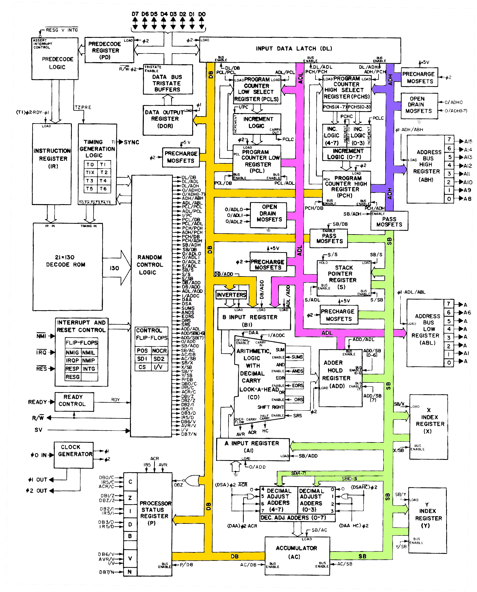

# 6502 Single Board Computer

Initiated from [Ben Eater's Design](https://eater.net/6502), I decided to get into computer design by physically recreating it and learning the theory along the way.

<!-- more -->

## The 6502

The 6502 microprocessor is a 

## BreadBoard

I never fully got the above board to boot as I got distracted with other projects before I flashed any program.

## DB6502

Breadboards (especailly aluminum backed) are surprisingly expensive. As such I decided to order a PCB version with the [Discrete Logic Computer](./discrete_logic_computer.md) PCB. Again another [community member](https://github.com/dbuchwald/6502) had published a design based upon Eater's version. The DB6502 -as it's termed- addionital contains two 6522 per. one of the 6522 links to a inbuilt 2x14 LCD and an ATtiny microcontroller for connection to a PS/2 keyboard. 

## EEPROM Programmer

Ben Eater used an Uno with 2 74' Shift registers. I didn't have any on hand, but the reason for the shift registers was due to the lack of digital outputs on the Uno. I did have a Mega on hand which has many more outputs. 

Found this code: [GitHub - crmaykish/AT28C-EEPROM-Programmer-Arduino: Programming the AT28C64B or AT28C256 EEPROM chip with an Arduino Mega](https://github.com/crmaykish/AT28C-EEPROM-Programmer-Arduino)

Which uses a Arduino Mega but found connecting all leads to be a waste of time. 